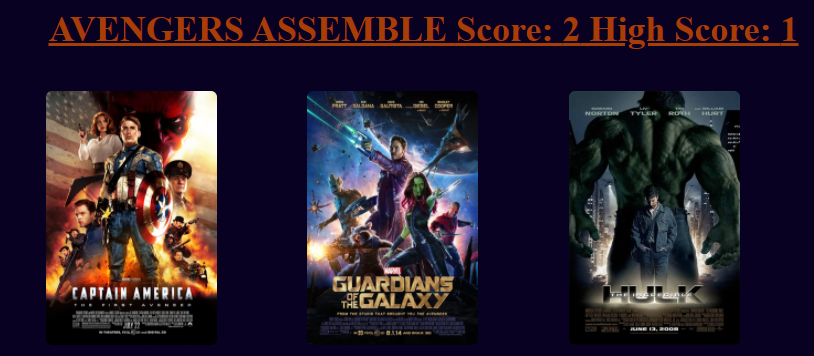
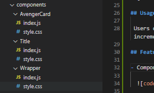
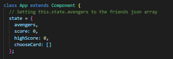
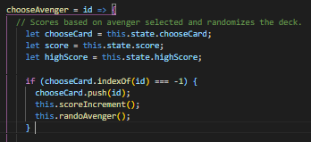
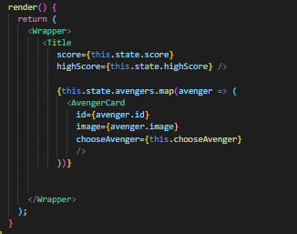
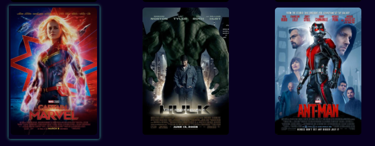

# avengers_match_up
  

A match up, imagine selecting game with a twist. Built with React, , React Router Dom, and Axios.

## Table of Contents

* [Tech Used](#tech_used)
* [Usage](#usage)
* [Features](#features)
* [Deployed_Link](#deployed_link)
* [Author](#author)
* [License](#license)

----

## Tech Used

* [HTML](https://developer.mozilla.org/en-US/docs/Web/HTML)
* [React](https://reactjs.org/)
* [React Router Dom](https://reactrouter.com/web/guides/quick-start)
* [Axios](https://www.npmjs.com/package/axios)
* [NPM](https://www.npmjs.com/)
* [Javascript](https://developer.mozilla.org/en-US/docs/Web/JavaScript)

## Usage
 
 Users can play an interactive match up game. To play users click on images, which will regenerate in a new order. Users play until they click on the same image twice. The score increments until an image is clicked twice at which point the game restarts. A high score is stored in a high score field. 

## Features

- Components are arranged for games playing cards, title, and wrapper.

  

- State is set for score, high score, and an empty array to randomize cards.

  

- ChooseAvenger function determines what action happens on each State change.

  

- On each State change the updated page is rendered.

  

## Deployed Link

  

* [See Live Site](https://ajhuff7.github.io/avengers_match_up/)

---

## Author

**AJ Huff** 

- [Portfolio Site](https://ajhuff7.github.io/portfolio-b/)
- [Github](https://github.com/ajhuff7)
- [LinkedIn](https://www.linkedin.com/in/aj-huff-7696b14b/)

## License

 